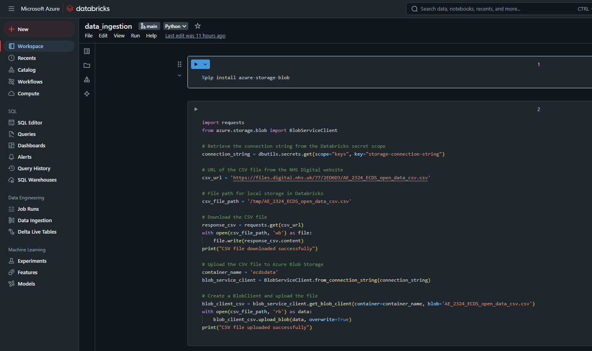
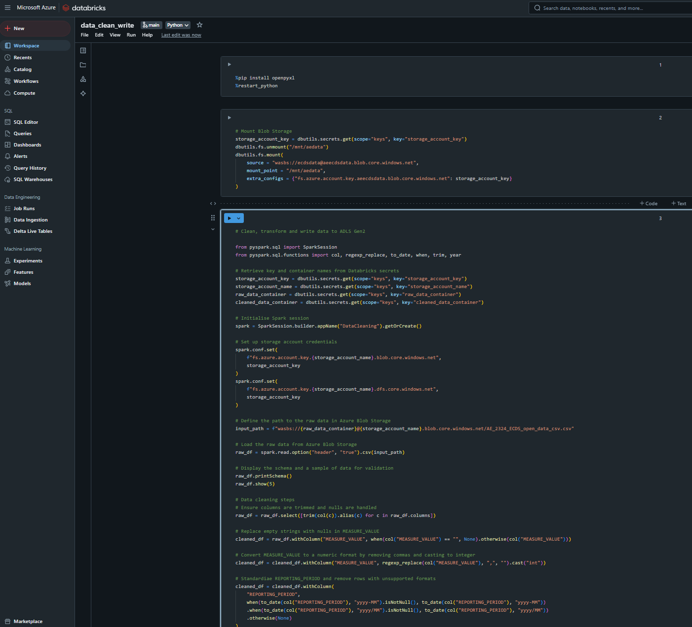
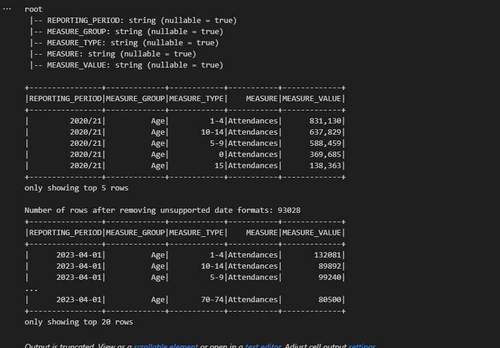

# AE-ECDS-reporting-pipeline
Data pipeline for emergency department (ED) activity across England, including the number of attendances, admissions, and other key metrics. By ingesting and analysing this data, we can uncover insights to help improve the efficiency and quality of emergency care delivery in both primary and secondary healthcare settings.

---

## Overview

This pipeline automates the extraction, transformation, and loading (ETL) of annual ED data published by NHS Digital into Azure Data Lake Storage (ADLS) Gen2. The data is processed to ensure consistency and quality, then stored in a partitioned format by `year`, optimised for efficient querying and analysis.
Dataset used: https://files.digital.nhs.uk/77/2ED6D3/AE_2324_ECDS_open_data_csv.csv on the NHS Digital website.
---

## Architecture

### Flow
1. **Extraction**: Data is downloaded from the NHS Digital website and staged in an Azure Blob Storage container.
2. **Transformation**: The data is cleaned, standardized, and validated in Databricks, with key data quality checks.
3. **Loading**: The cleaned, partitioned data is stored in ADLS Gen2 in Parquet format for efficient querying.

---

## Tools Used

- **Azure Data Factory (ADF)**: Orchestrates the pipeline, managing the extraction, transformation, and loading (ETL) steps.
- **Azure Blob Storage**: Stages raw CSV data from NHS Digital.
- **Azure Databricks**: Processes, cleans, and transforms data for storage.
- **Azure Data Lake Storage Gen2 (ADLS Gen2)**: Stores cleaned, partitioned data in Parquet format.
- **Azure Key Vault**: Manages and stores secrets (e.g., storage account keys).
- **Databricks Jobs**: Automates and schedules the ETL process.
- **GitHub**: Used for version control, repository integrated with Databricks.

---

## Technical Details

The two scripts used are found in the 'databricks_notebooks' folder.

### 1. Extraction

**Objective**: Download the CSV file from NHS Digital’s website and store it in Azure Blob Storage as a staging area.

- **Location**: `wasbs://ecdsdata@aeecdsdata.blob.core.windows.net/AE_2324_ECDS_open_data_csv.csv`
- **Storage Access**: Created Databricks Secret Scope from Azure Key Vault to manage and access keys and connection strings for Blob Storage access.
- **Steps Using Python**:
  1. **Download the Data**: The CSV file is downloaded from the NHS Digital website using the `requests` library. This approach enables automated retrieval of the latest data.
  2. **Save Locally in Databricks**: The downloaded file is temporarily saved in the Databricks file system (`/tmp/`) to facilitate upload.
  3. **Upload to Azure Blob Storage**:
     - **Connection Setup**: Using the `azure.storage.blob` library, a `BlobServiceClient` is created to handle connections to Blob Storage. The connection string is securely retrieved from Databricks Secrets.
     - **Blob Upload**: A `BlobClient` uploads the CSV file to the specified container in Blob Storage. The container (`ecdsdata`) acts as a staging area for the raw data, ensuring that it is stored and readily accessible for the transformation step.

  

### 2. Transformation

**Objective**: Clean and transform the data for consistency and quality.

- **Environment**: Databricks Notebook with mounted Blob Storage.
- **Steps**:
  - **Trim Whitespaces** and **Handle Nulls** across columns.
  - **Cast 'MEASURE_VALUE'** as an integer by removing commas.
  - **Standardise 'REPORTING_PERIOD'** to `yyyy-MM` format.
  - **Add Partition Column (`year`)**: Extract the year from `REPORTING_PERIOD` to use for partitioning.
    
- **Detailed Steps**:
  - **Data Type Casting**: Convert the `MEASURE_VALUE` column to integer format by removing commas, allowing for numeric calculations in later analyses.
  - **Date Standardisation**: Convert the `REPORTING_PERIOD` column into a consistent `yyyy-MM` date format for uniformity across data.
  - **Partition Column (`year`) Creation**: Extract the `year` from `REPORTING_PERIOD` and add it as a separate column to enable partitioning by year.
  - **Data Quality Checks**: Verify that nulls are handled and that `MEASURE_VALUE` contains valid numeric data; any rows with unsupported formats or invalid data types are removed.

  
  

### 3. Storage in Azure Data Lake Storage Gen2 (ADLS Gen2)

**Objective**: Store the cleaned and transformed data in ADLS Gen2 in a structured, partitioned format to optimis performance, storage costs, and future querying needs.

- **Partitioning by Year**: The data is partitioned by `year`, with a folder structure organised to enhance querying performance. This setup minimises the data scanned during time-based queries by enabling **partition pruning**.
  
- **File Format**: Data is saved in **Parquet format**, a columnar storage format known for efficient compression and fast analytical performance, especially for large datasets with multiple columns. Parquet is optimised for read-heavy operations, which is advantageous for subsequent analytics.
- **Advantages of This Structure**:
- **Partition Pruning**: Queries that filter on the `year` column will only scan relevant data, resulting in faster query times and reduced costs.
- **Scalability**: Partitioned storage allows for easier scalability as data grows yearly.

### 4. Scheduling and Automation

**Objective**: Automate the ETL pipeline to ensure data is ingested and processed annually upon release.

- **Azure Data Factory**: Schedules and automates the ETL pipeline to run annually. ADF triggers Databricks Jobs for transformation and manages the overall flow between storage and processing layers.
- **Monitoring**: ADF provides monitoring and alerting to track pipeline performance, detect failures, and send notifications when issues arise.

### 4. Data Analysis
An outline of potential data analysis capabilities for this data using Databricks.

  - **Data Analysis in Databricks**:
  - Databricks is used to load and analyse the partitioned Parquet data in ADLS Gen2. Using Spark SQL, analysts can run complex queries, filter data by `year`, and perform aggregations on key metrics (e.g., total attendances and admissions).
  - **Data Visualisation**: Visualisations such as bar charts and line graphs can be generated in Databricks notebooks to provide insights into trends over time, by using tools like **Matplotlib**, **Seaborn**, or the built-in Databricks plotting features.
  - **Machine Learning**: If advanced analytics or predictive modeling is required, Databricks’ integration with ML libraries (e.g., **MLflow**, **MLlib**) makes it easy to implement machine learning models on the cleaned data.

  ---

## Summary

The AE-ECDS Reporting Pipeline, orchestrated by Azure Data Factory, provides an efficient, scalable, and secure solution for processing, storing, and analysing emergency department data. The integration of ADF enables seamless automation, while Databricks performs advanced transformations, ensuring that high-quality data is available to improve emergency healthcare services across England.

Potential use cases include resource planning, performance monitoring, policy evaluation and future research.
